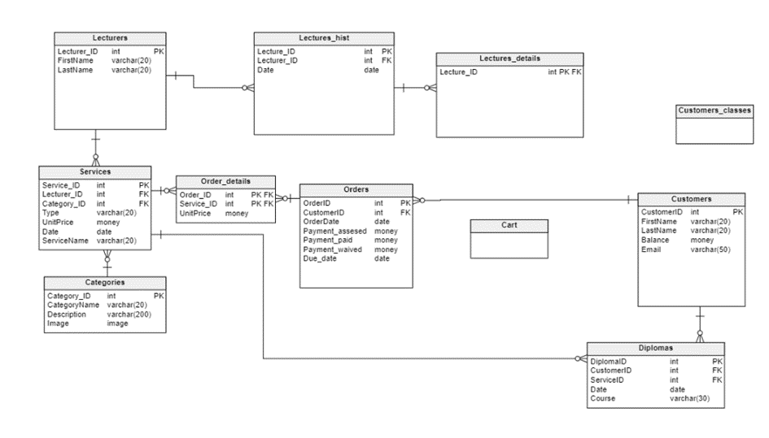

# RAPORT PROJEKTU Z PODSTAW BAZ DANYCH 23/24
## System bazy danych firmy oferującej usługi naukowe
## Spis treści
1. [Opis systemu](#opis)
2. [Funkcje realizowane przez system](#funkcje)
    1. [Klient firmy](#klient)
    2. [Pracownicy](#pracownicy)
        1. [Wykładowcy](#wykladowcy)
        2. [Pracownicy organizacyjni](#pracownicyorgy)
        3. [Dyrektor Szkoły](#dyro)
3. [Diagram Bazy Danych](#diagram)

## 1.	Opis systemu 
Firma oferuje różnorakie usługi naukowe w postaci kursów, webinarów oraz umożliwia zapis na studia. Zajęcia przeprowadzane są w formie stacjonarnej, online bądź hybrydowej, zależnie od typu usługi.

Klient może zakupić równolegle dostęp do wielu usług lub uzyskać dostęp do darmowych spotkań i nagrań.

System zawiera informacje o założonych kontach, wykupionych usługach, statusach zajęć oraz płatności oraz możliwość modyfikacji poszczególnych danych, przez uprawnione do tego jednostki.

## 2.	Funkcje realizowane przez system 
### 2.1.	Klient firmy 
- Założenie konta i logowanie się do niego każdorazowo
- Wyświetlanie oferty usług świadczonych przez firmę
- Zapisanie się na webinary, kursy, studia lub pojedyncze zajęcia ze studiów
- Dostęp do:
    - Własnego harmonogramu zajęć
    - Historii odbytych zajęć wraz ze statusem obecności
    - Zakupionych usług
    - Bilansu konta
    - Darmowych bądź zakupionych nagrań świadczonych usług
- Dodanie wybranych usług do koszyka
- Dokonanie płatności za usługi 
- Zakup nagrań świadczonych usług
- Odebranie dyplomu po zakończonym cyklu zajęć
- Wyświetlanie zajęć kolidujących ze sobą
### 2.2.	Pracownicy 
- Założenie konta i logowanie się do niego każdorazowo
- Dostęp do:
    - Podstawowych informacji na temat stanu systemu
#### 2.2.1.	Wykładowcy 
- Dostęp do informacji dotyczących prowadzonych przez niego zajęć
- Wprowadzanie obecności na zajęciach
- Ustalanie zaliczeń po zakończonym cyklu zajęć
#### 2.2.2.	Pracownicy organizacyjni 
- Ustalanie i modyfikacje harmonogramu poszczególnych zajęć
- Obsługiwanie raportów o:
    - Zestawieniu przychodów dla każdego webinaru/kursu/studium.
    - Liście „dłużników” – osób, które skorzystały z usług, ale nie uiściły opłat.
    - Liczbie osób zapisanych na przyszłe wydarzenia.
    - Frekwencji na zakończonych już wydarzeniach.
    - Liście obecności dla każdego szkolenia z datą, imieniem, nazwiskiem i informacją czy uczestnik był obecny, czy nie
    - Bilokacji: lista osób, które są zapisane na co najmniej dwa przyszłe szkolenia, które ze sobą kolidują czasowo
- Dodawanie tłumacza na wydarzenia
#### 2.2.3.	Dyrektor Szkoły 
- Zatwierdzanie wyjątków dotyczących odroczenia płatności
## 3.	Diagram Bazy Danych 
 
