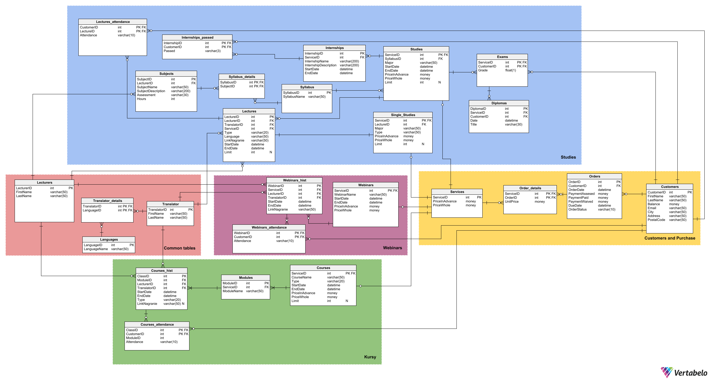

Król Mateusz 
Zieliński Filip 
Wietrzny Wojciech
# RAPORT PROJEKTU Z PODSTAW BAZ DANYCH 23/24
## System bazy danych firmy oferującej usługi naukowe
## Spis treści
1. [Opis systemu](#opis)
2. [Funkcje realizowane przez system](#funkcje)
    1. [Klient firmy](#klient)
    2. [Pracownicy](#pracownicy)
        1. [Wykładowcy](#wykladowcy)
        2. [Pracownicy organizacyjni](#pracownicyorgy)
        3. [Dyrektor Szkoły](#dyro)
3. [Diagram Bazy Danych](#diagram)
4. [Realizowane tabele](#tabels)
    1. [Customers and Purchase](#c&p)
    2. [Studies](#std)
    3. [Webinars](#web)
    4. [Kursy](#crs)
    5. [Common tables](#ctb)
5. [Widoki](#widoki)
6. [Funkcje](#funkcje)
7. [Procedury](#procedury)



## 1.	Opis systemu <a name="opis"></a>
Firma oferuje różnorakie usługi uczelniane w postaci kursów, webinarów oraz umożliwia zapis na studia. Zajęcia przeprowadzane są w formie stacjonarnej, online bądź hybrydowej, zależnie od typu usługi.

Klient może zakupić równolegle dostęp do wielu usług lub uzyskać dostęp do darmowych spotkań i nagrań.

System zawiera informacje o założonych kontach, wykupionych usługach, statusach zajęć oraz płatności oraz możliwość modyfikacji poszczególnych danych, przez uprawnione do tego jednostki.

## 2.	Funkcje realizowane przez system <a name="funkcje"></a>
### 2.1.	Klient firmy <a name="klient"></a>
- Wyświetlanie oferty usług świadczonych przez firmę
- Zapisanie się na webinary, kursy, studia lub pojedyncze zajęcia ze studiów
- Dostęp do:
    - Własnego harmonogramu zajęć
    - Historii odbytych zajęć wraz ze statusem obecności
    - Zakupionych usług
    - Bilansu konta
    - Darmowych bądź zakupionych nagrań świadczonych usług
- Dodanie wybranych usług do koszyka
- Dokonanie płatności za usługi 
- Zakup nagrań świadczonych usług
- Odebranie dyplomu po zakończonym cyklu zajęć
- Wyświetlanie zajęć kolidujących ze sobą
### 2.2. Pracownicy <a name="pracownicy"></a>
#### 2.2.1.	Wykładowcy <a name="wykladowcy"></a>
- Dostęp do informacji dotyczących prowadzonych przez niego zajęć
- Wprowadzanie obecności na zajęciach
- Ustalanie zaliczeń po zakończonym cyklu zajęć
#### 2.2.2.	Pracownicy organizacyjni <a name="pracownicyorg"></a>
- Ustalanie i modyfikacje harmonogramu poszczególnych zajęć
- Obsługiwanie raportów o:
    - Zestawieniu przychodów dla każdego webinaru/kursu/studium.
    - Liście „dłużników” – osób, które skorzystały z usług, ale nie uiściły opłat.
    - Liczbie osób zapisanych na przyszłe wydarzenia.
    - Frekwencji na zakończonych już wydarzeniach.
    - Liście obecności dla każdego szkolenia z datą, imieniem, nazwiskiem i informacją czy uczestnik był obecny, czy nie
    - Bilokacji: lista osób, które są zapisane na co najmniej dwa przyszłe szkolenia, które ze sobą kolidują czasowo
- Dodawanie tłumacza na wydarzenia
#### 2.2.3.	Dyrektor Szkoły <a name="dyro"></a>
- Zatwierdzanie wyjątków dotyczących odroczenia płatności  
## 3.    Diagram Bazy Danych <a name="diagram"></a>
 


## 4.    Realizowane tabele <a name="tables"></a>
### 4.1    *Customers and Purchase* <a name="c&p"></a>
#### 4.1.1    Customers
- PK: CustomerID
- Opis: Tabela przechowuje informacje na temat klientów firmy/studentów

```sql
 CREATE TABLE Courses (
    ServiceID int IDENTITY(3,4) PRIMARY KEY,
    CourseName varchar(50)  NOT NULL,
    Type varchar(20)  CHECK(Type in ('Online', 'Hybrid', 'Stationary')) NOT NULL,
    StartDate datetime CHECK(StartDate >= '2019-01-01') NOT NULL,
    EndDate datetime   NOT NULL,
    PriceInAdvance money   NOT NULL,
    PriceWhole money  NOT NULL,
    Limit int NULL,
	CONSTRAINT CoursesDateCheck CHECK (
	ISDATE(StartDate) = 1 AND
	ISDATE(EndDate) = 1 AND
	EndDate > StartDate
	),
	CONSTRAINT CoursesPriceCheck CHECK (
	PriceInAdvance >= 0 AND
	PriceWhole >= 0 AND 
	PriceInAdvance <= PriceWhole
	),
	CONSTRAINT CoursesLimitCheck CHECK (
	Limit > 0 OR Limit IS NULL
	)
);

ALTER TABLE Courses ADD CONSTRAINT Courses_Cennik
    FOREIGN KEY (ServiceID)
    REFERENCES Services (ServiceID);
```

#### 4.1.2    Orders
- PK: OrderID
- FK: CustomerID
- Opis: Tabela przechowuje spis wszystkich przeszłych zamówień, pole *OrderStatus* wskazuje na to, czy zamówienie jest na razie w koszyku, czy zostało już zrealizowane

```sql
CREATE TABLE Orders (
    OrderID int  IDENTITY(1,1) PRIMARY KEY,
    CustomerID int  NOT NULL,
    OrderDate datetime CHECK(OrderDate >= '2019-01-01') NOT NULL,
    PaymentAssesed money  NOT NULL,
    PaymentPaid money  NOT NULL,
    PaymentWaived money  NOT NULL,
    DueDate datetime   NOT NULL,
    OrderStatus varchar(10) CHECK(OrderStatus in ('Ordered', 'InCart'))  NOT NULL,
	CONSTRAINT OrdersDateCheck CHECK (
	ISDATE(DueDate) = 1 AND
	ISDATE(OrderDate) = 1 AND
	DueDate > OrderDate
	),
	CONSTRAINT OrdersPaymentCheck CHECK (
	PaymentAssesed >= 0 AND
	PaymentPaid >= 0 AND
	PaymentWaived >= 0 AND
	PaymentAssesed >= PaymentPaid
	)
);

ALTER TABLE Orders ADD CONSTRAINT Orders_Customers
    FOREIGN KEY (CustomerID)
    REFERENCES Customers (CustomerID);
```
#### 4.1.3    Order_details
- PK: OrderID, ServiceID
- FK: OrderID, ServiceID
- Opis: Tabela przechowuje informacje na temat każdego z zamówień z tabeli *Orders*

```sql
CREATE TABLE Order_details (
    ServiceID int  NOT NULL,
    OrderID int  NOT NULL,
    UnitPrice money  NOT NULL,
    CONSTRAINT Order_details_pk PRIMARY KEY  (ServiceID,OrderID),
	CONSTRAINT Order_detailsUnitPriceCheck CHECK (
	UnitPrice >= 0
	)
);

ALTER TABLE Order_details ADD CONSTRAINT Order_details_Orders
    FOREIGN KEY (OrderID)
    REFERENCES Orders (OrderID);
```
#### 4.1.4    Services
- PK: ServiceID
- Opis: Tabela przechowuje wszystkie usługi wraz z ceną

```sql
CREATE TABLE Services (
    ServiceID int  PRIMARY KEY,
    PriceInAdvance money   NOT NULL,
    PriceWhole money  NOT NULL,
	CONSTRAINT ServicesPriceCheck CHECK (
	PriceInAdvance >= 0 AND
	PriceWhole >= 0 AND 
	PriceInAdvance <= PriceWhole
	)
);
```
&nbsp;
### 4.2    *Studies* <a name="std"></a>
#### 4.2.1  Studies
- PK: ServiceID
- FK: ServiceID, SyllabusID
- Opis: Tabela przechowuje wszystkie realizowane studia teraz i w przeszłości

```sql
CREATE TABLE Studies (
    ServiceID int IDENTITY(2,4) PRIMARY KEY,
    SyllabusID int  NOT NULL,
    Major varchar(50)  CHECK (LEFT(Major, 1) = UPPER(LEFT(Major, 1))) NOT NULL,
    StartDate datetime CHECK(StartDate >= '2019-01-01') NOT NULL,
    EndDate datetime   NOT NULL,
    PriceInAdvance money  NOT NULL,
    PriceWhole money  NOT NULL,
	Limit int NULL,
	CONSTRAINT StudiesDateCheck CHECK (
	ISDATE(StartDate) = 1 AND
	ISDATE(EndDate) = 1 AND
	EndDate > StartDate
	),
	CONSTRAINT StudiesPriceCheck CHECK (
	PriceInAdvance >= 0 AND
	PriceWhole >= 0 AND 
	PriceInAdvance <= PriceWhole
	),
	CONSTRAINT StudiesLimitCheck CHECK (
	Limit > 0 OR Limit IS NULL
	)
);

ALTER TABLE Studies ADD CONSTRAINT Studies_Cennik
    FOREIGN KEY (ServiceID)
    REFERENCES Services (ServiceID);

ALTER TABLE Studies ADD CONSTRAINT Studies_Syllabus
    FOREIGN KEY (SyllabusID)
    REFERENCES Syllabus (SyllabusID);
```
#### 4.2.2  SingleStudies
- PK: ServiceID
- FK: ServiceID
- Opis: Tabela przechowuje możliwe pojedyncze zajęcia studyjne

```sql
CREATE TABLE Single_Studies (
    ServiceID int IDENTITY(4,4) PRIMARY KEY,
	LectureID int NOT NULL,
    Major varchar(50)  CHECK (LEFT(Major, 1) = UPPER(LEFT(Major, 1))) NOT NULL,
	Type varchar(20)  CHECK(Type in ('Online', 'Hybrid', 'Stationary')) NOT NULL, 
	Limit int NULL,
    PriceInAdvance money   NOT NULL,
    PriceWhole money  NOT NULL,
	CONSTRAINT Single_StudiesPriceCheck CHECK (
	PriceInAdvance >= 0 AND
	PriceWhole >= 0 AND 
	PriceInAdvance <= PriceWhole
	),
	CONSTRAINT Single_StudiesLimitCheck CHECK (
	Limit > 0 OR Limit IS NULL
	)
);

ALTER TABLE Single_Studies ADD CONSTRAINT Services_Single_Studies
    FOREIGN KEY (ServiceID)
    REFERENCES Services (ServiceID);

ALTER TABLE Single_Studies ADD CONSTRAINT Lectures_Single_Studies
    FOREIGN KEY (LectureID)
    REFERENCES Lectures(LectureID);
```
#### 4.2.3  Lectures
- PK: LectureID
- FK: ServiceID, LecturerID, TranslatorID
- Opis: Tabela przechowuje wszystkie histoyczne wykłady zajęć studyjnych

```sql
CREATE TABLE Lectures (
    LectureID int IDENTITY(1,1) PRIMARY KEY,
    LecturerID int  NOT NULL,
    TranslatorID int  NOT NULL,
    ServiceID int  NOT NULL,
    Type varchar(20)  CHECK(Type in ('Online', 'Hybrid', 'Stationary')) NOT NULL,
    Language varchar(50) CHECK (LEFT(Language, 1) = UPPER(LEFT(Language, 1))) NOT NULL,
	LinkNagranie varchar(50) NULL,
	StartDate datetime NOT NULL,
    EndDate datetime  NOT NULL,
	Limit int NULL,
	CONSTRAINT LecturesDateCheck CHECK (
	ISDATE(StartDate) = 1 AND
	ISDATE(EndDate) = 1 AND
	EndDate > StartDate
	),
	CONSTRAINT LecturesLimitCheck CHECK (
	Limit > 0 OR Limit IS NULL
	)
);

ALTER TABLE Lectures ADD CONSTRAINT Lectures_Lecturers
    FOREIGN KEY (LecturerID)
    REFERENCES Lecturers (LecturerID);

ALTER TABLE Lectures ADD CONSTRAINT Lectures_Studies
    FOREIGN KEY (ServiceID)
    REFERENCES Studies (ServiceID);

ALTER TABLE Lectures ADD CONSTRAINT Lectures_Translator
    FOREIGN KEY (TranslatorID)
    REFERENCES Translator (TranslatorID);
```
#### 4.2.4  Lectures_attendance
- PK: CustomerID, LectureID
- FK: CustomerID, LectureID
- Opis: Tabela przechowuje listę obecności każdego wykładu
```sql
CREATE TABLE Lectures_attendance (
    CustomerID int  NOT NULL,
    LectureID int  NOT NULL,
    Attendance varchar(10) CHECK(Attendance in ('Present', 'Absent'))  NOT NULL,
    CONSTRAINT Lectures_attendance_pk PRIMARY KEY  (CustomerID,LectureID)
);

ALTER TABLE Lectures_attendance ADD CONSTRAINT Lectures_attendance_Lectures
    FOREIGN KEY (LectureID)
    REFERENCES Lectures (LectureID);

ALTER TABLE Lectures_attendance ADD CONSTRAINT Lectures_details_Customers
    FOREIGN KEY (CustomerID)
    REFERENCES Customers (CustomerID);
```
#### 4.2.5  Exams
- PK: CustomerID, ServiceID
- FK: CustomerID, ServiceID
- Opis: Tabela przechowuje listę egzaminów każdego ze studentów

```sql
CREATE TABLE Exams (
    ServiceID int  NOT NULL,
    CustomerID int  NOT NULL,
    Grade float(1) CHECK (Grade in (2.0,3.0,3.5,4.0,4.5,5.0))  NOT NULL,
    CONSTRAINT Exams_pk PRIMARY KEY  (ServiceID,CustomerID)
);

ALTER TABLE Exams ADD CONSTRAINT Exams_Customers
    FOREIGN KEY (CustomerID)
    REFERENCES Customers (CustomerID);

ALTER TABLE Exams ADD CONSTRAINT Exams_Studies
    FOREIGN KEY (ServiceID)
    REFERENCES Studies (ServiceID);
```
#### 4.2.6  Diplomas
- PK: DiplomaID
- FK: CustomerID, ServiceID
- Opis: Tabela przechowuje dyplomy przyznane za ukończenie studiów

```sql
CREATE TABLE Diplomas (
    DiplomaID int IDENTITY(1,1) PRIMARY KEY,
    ServiceID int  NOT NULL,
    CustomerID int  NOT NULL,
    Date datetime  CHECK(Date >= '2019-01-01') NOT NULL,
    Title varchar(30) CHECK (LEFT(Title, 1) = UPPER(LEFT(Title, 1))) NOT NULL,
	CONSTRAINT DiplomasDateCheck CHECK (
	ISDATE(Date) = 1
	)
);

ALTER TABLE Diplomas ADD CONSTRAINT Diplomas_Exams
    FOREIGN KEY (ServiceID,CustomerID)
    REFERENCES Exams (ServiceID,CustomerID);
```
#### 4.2.7  Internships
- PK: InternshipID
- FK: ServiceID
- Opis: Tabela przechowuje praktyki z każdych studiów

```sql
CREATE TABLE Internships (
    InternshipID int  IDENTITY(1,1) PRIMARY KEY,
    ServiceID int  NOT NULL,
    InternshipName varchar(200) CHECK (LEFT(InternshipName, 1) = UPPER(LEFT(InternshipName, 1))) NOT NULL,
    InternshipDescription varchar(200)   NOT NULL,
    StartDate datetime CHECK(StartDate >= '2019-01-01') NOT NULL,
    EndDate datetime  NOT NULL,
	CONSTRAINT InternshipsDateCheck CHECK (
	ISDATE(StartDate) = 1 AND
	ISDATE(EndDate) = 1 AND
	EndDate > StartDate
	)
);

ALTER TABLE Internships ADD CONSTRAINT Internships_Studies
    FOREIGN KEY (ServiceID)
    REFERENCES Studies (ServiceID);
```
#### 4.2.8  Internships_passed
- PK: InternshipID, CustomerID
- FK: InternshipID, CustomerID
- Opis: Tabela przechowuje informację, czy praktyka została zaliczona przez danego studenta

```sql
CREATE TABLE Internships_passed (
    InternshipID int  NOT NULL,
    CustomerID int  NOT NULL,
    Passed varchar(3) CHECK(Passed in ('Yes', 'No')) NOT NULL,
    CONSTRAINT Internships_passed_pk PRIMARY KEY  (InternshipID,CustomerID)
);

ALTER TABLE Internships_passed ADD CONSTRAINT Internships_passed_Customers
    FOREIGN KEY (CustomerID)
    REFERENCES Customers (CustomerID);

ALTER TABLE Internships_passed ADD CONSTRAINT Internships_passed_Internships
    FOREIGN KEY (InternshipID)
    REFERENCES Internships (InternshipID);
```
#### 4.2.9  Syllabus
- PK: SyllabusID
- Opis: Tabela przechowuje plan zajęć każdego z kierunków studiów

```sql
CREATE TABLE Syllabus (
    SyllabusID int IDENTITY(1,1) PRIMARY KEY,
    SyllabusName varchar(50) CHECK (LEFT(SyllabusName, 1) = UPPER(LEFT(SyllabusName, 1))) NOT NULL,
);
```
#### 4.2.10  Syllabus_details
- PK: SyllabusID, SubjectID
- FK: SyllabusID, SubjectID
- Opis: Tabela przechowuje przedmioty każdego z Syllabusów

```sql
CREATE TABLE Syllabus_details (
    SyllabusID int  NOT NULL,
    SubjectID int  NOT NULL,
    CONSTRAINT Syllabus_details_pk PRIMARY KEY  (SubjectID,SyllabusID)
);

ALTER TABLE Syllabus_details ADD CONSTRAINT Syllabus_details_Subjects
    FOREIGN KEY (SubjectID)
    REFERENCES Subjects (SubjectID);

ALTER TABLE Syllabus_details ADD CONSTRAINT Syllabus_details_Syllabus
    FOREIGN KEY (SyllabusID)
    REFERENCES Syllabus (SyllabusID);
```
#### 4.2.11 Subjects
- PK: SubjectID
- FK: LecturerID
- Opis: Tabela przechowuje informacje na temat każdego z przedmiotów studyjnych

```sql
CREATE TABLE Subjects (
    SubjectID int  IDENTITY(1,1) PRIMARY KEY,
    LecturerID int  NOT NULL,
    SubjectName varchar(50) CHECK (LEFT(SubjectName, 1) = UPPER(LEFT(SubjectName, 1))) NOT NULL,
    SubjectDescription varchar(200) NOT NULL,
    Hours int  NOT NULL,
    Assessment varchar(30) CHECK(Assessment in ('Attendance', 'Exam', 'Internship'))NOT NULL,
	CONSTRAINT SubjectsHoursCheck CHECK (
	Hours > 0
	)
);

ALTER TABLE Subjects ADD CONSTRAINT Subjects_Lecturers
    FOREIGN KEY (LecturerID)
    REFERENCES Lecturers (LecturerID);
```
&nbsp;
### 4.3   *Webinars* <a name="web"></a>
#### 4.3.1   Webinars
- PK: ServiceID
- FK: ServiceID
- Opis: Tabela przechowuje wszystkie webinary

```sql
CREATE TABLE Webinars (
    ServiceID int  IDENTITY(1,4) PRIMARY KEY,
    WebinarName varchar(50)  CHECK (LEFT(WebinarName, 1) = UPPER(LEFT(WebinarName, 1))) NOT NULL,
	StartDate datetime CHECK(StartDate >= '2019-01-01') NOT NULL,
    EndDate datetime  NOT NULL,
    PriceInAdvance money   NOT NULL,
    PriceWhole money  NOT NULL,
	CONSTRAINT WebinarsDateCheck CHECK (
	ISDATE(StartDate) = 1 AND
	ISDATE(EndDate) = 1 AND
	EndDate > StartDate
	),
	CONSTRAINT WebinarsPriceCheck CHECK (
	PriceInAdvance >= 0 AND
	PriceWhole >= 0 AND 
	PriceInAdvance <= PriceWhole
	)
);

ALTER TABLE Webinars ADD CONSTRAINT Webinars_Services
    FOREIGN KEY (ServiceID)
    REFERENCES Services (ServiceID);
```
#### 4.3.2   Webinars_hist
- PK: ServiceID, LecturerID
- FK: ServiceID, LecturerID, TranslatorID
- Opis: Tabela przechowuje informacje na temat każdego z webinarów

```sql
CREATE TABLE Webinars_hist (
    WebinarID int IDENTITY(1,1) PRIMARY KEY,
    ServiceID int  NOT NULL,
    LecturerID int  NOT NULL,
    TranslatorID int  NOT NULL,
    StartDate datetime CHECK(StartDate >= '2019-01-01')  NOT NULL,
    EndDate datetime  NOT NULL,
    LinkNagranie varchar(50)  NOT NULL,
    CONSTRAINT Webinars_histDateCheck CHECK (
    ISDATE(StartDate) = 1 AND
    ISDATE(EndDate) = 1 AND
    EndDate > StartDate
    )
);

ALTER TABLE Webinars_hist ADD CONSTRAINT Webinars_hist_Lecturers
    FOREIGN KEY (LecturerID)
    REFERENCES Lecturers (LecturerID);

ALTER TABLE Webinars_hist ADD CONSTRAINT Webinars_hist_Translator
    FOREIGN KEY (TranslatorID)
    REFERENCES Translator (TranslatorID);

ALTER TABLE Webinars_hist ADD CONSTRAINT Webinars_hist_Webinars
    FOREIGN KEY (ServiceID)
    REFERENCES Webinars (ServiceID);
```

#### 4.3.3   Webinars_attendance
- PK: WebinarID, CustomerID
- FK: WebinarID, CustomerID
- Opis: Tabela przechowuje informacje na temat obecności na webinarach

```sql
CREATE TABLE Webinars_attendance (
    WebinarID int  NOT NULL,
    CustomerID int  NOT NULL,
    Attendance varchar(10)  NOT NULL,
    CONSTRAINT Webinars_attendance_pk PRIMARY KEY  (CustomerID,WebinarID)
);
```
&nbsp;
### 4.3    *Kursy* <a name="crs"></a>
#### 4.3.1  Courses
- PK: ServiceID
- FK: ServiceID
- Opis: Tabela przechowuje wszystkie realizowane kursy teraz i w przeszłości

```sql
CREATE TABLE Courses (
    ServiceID int IDENTITY(3,4) PRIMARY KEY,
    CourseName varchar(50)  NOT NULL,
    Type varchar(20)  CHECK(Type in ('Online', 'Hybrid', 'Stationary')) NOT NULL,
    StartDate datetime CHECK(StartDate >= '2019-01-01') NOT NULL,
    EndDate datetime   NOT NULL,
    PriceInAdvance money   NOT NULL,
    PriceWhole money  NOT NULL,
    Limit int NULL,
	CONSTRAINT CoursesDateCheck CHECK (
	ISDATE(StartDate) = 1 AND
	ISDATE(EndDate) = 1 AND
	EndDate > StartDate
	),
	CONSTRAINT CoursesPriceCheck CHECK (
	PriceInAdvance >= 0 AND
	PriceWhole >= 0 AND 
	PriceInAdvance <= PriceWhole
	),
	CONSTRAINT CoursesLimitCheck CHECK (
	Limit > 0 OR Limit IS NULL
	)
);

ALTER TABLE Courses ADD CONSTRAINT Courses_Cennik
    FOREIGN KEY (ServiceID)
    REFERENCES Services (ServiceID);
```
#### 4.3.2  Modules
- PK: ModuleID
- FK: ServiceID
- Opis: Tabela przechowuje listę modułów każdego z kursów

```sql
CREATE TABLE Modules (
    ModuleID int  IDENTITY(1,1) PRIMARY KEY,
    ServiceID int  NOT NULL,
    ModuleName varchar(50) NOT NULL
);

ALTER TABLE Modules ADD CONSTRAINT Modules_Courses
    FOREIGN KEY (ServiceID)
    REFERENCES Courses (ServiceID);
```
#### 4.3.3  Courses_hist
- PK: ClassID
- FK: ModuleID, LecturerID, TranslatorID
- Opis: Tabela przechowuje informacje o każdym module

```sql
CREATE TABLE Courses_hist (
    ClassID int IDENTITY(1,1) PRIMARY KEY,
    ModuleID int  NOT NULL,
    LecturerID int  NOT NULL,
    TranslatorID int  NOT NULL,
	StartDate datetime CHECK(StartDate >= '2019-01-01') NULL,
    EndDate datetime  NOT NULL,
	Type varchar(20)  CHECK(Type in ('Online', 'Hybrid', 'Stationary')) NOT NULL,
	LinkNagranie varchar(50) NULL,
	CONSTRAINT Courses_histDateCheck CHECK (
	ISDATE(StartDate) = 1 AND
	ISDATE(EndDate) = 1 AND
	EndDate > StartDate
	)
);

ALTER TABLE Courses_hist ADD CONSTRAINT Courses_hist_Lecturers
    FOREIGN KEY (LecturerID)
    REFERENCES Lecturers (LecturerID);

ALTER TABLE Courses_hist ADD CONSTRAINT Courses_hist_Modules
    FOREIGN KEY (ModuleID)
    REFERENCES Modules (ModuleID);

ALTER TABLE Courses_hist ADD CONSTRAINT Courses_hist_Translator
    FOREIGN KEY (TranslatorID)
    REFERENCES Translator (TranslatorID);
```
#### 4.3.4  Courses_attendace
- PK: ClassID, CustomerID
- FK: ClassID, CustomerID
- Opis: Tabela przechowuje listę obecności każdego z modułów

```sql
CREATE TABLE Courses_attendance (
    ClassID int  NOT NULL,
    CustomerID int  NOT NULL,
    ModuleID int  NOT NULL,
    Attendance varchar(10) CHECK(Attendance in ('Present', 'Absent'))  NOT NULL,
    CONSTRAINT Courses_attendance_pk PRIMARY KEY  (CustomerID,ClassID)
);

ALTER TABLE Courses_attendance ADD CONSTRAINT Courses_attendance_Courses_hist
    FOREIGN KEY (ClassID)
    REFERENCES Courses_hist (ClassID);

ALTER TABLE Courses_attendance ADD CONSTRAINT Courses_attendance_Customers
    FOREIGN KEY (CustomerID)
    REFERENCES Customers (CustomerID);
```
&nbsp;
### 4.4 *Common tables* <a name="ctb"></a>
#### 4.4.1   Lecturers
- PK: LecturerID
- Opis: Tabela przechowuje informacje na temat każdego z wykładowców

```sql
CREATE TABLE Lecturers (
    LecturerID int IDENTITY(1,1) PRIMARY KEY,
    FirstName varchar(50) CHECK (LEFT(FirstName, 1) = UPPER(LEFT(FirstName, 1))) NOT NULL,
    LastName varchar(50) CHECK (LEFT(LastName, 1) = UPPER(LEFT(LastName, 1))) NOT NULL,
);

ALTER TABLE Lectures ADD CONSTRAINT Lectures_Lecturers
    FOREIGN KEY (LecturerID)
    REFERENCES Lecturers (LecturerID);

ALTER TABLE Lectures ADD CONSTRAINT Lectures_Studies
    FOREIGN KEY (ServiceID)
    REFERENCES Studies (ServiceID);

ALTER TABLE Lectures ADD CONSTRAINT Lectures_Translator
    FOREIGN KEY (TranslatorID)
    REFERENCES Translator (TranslatorID);
```
#### 4.4.2   Translator
- PK: TranslatorID
- Opis: Tabela przechowuje informacje na temat każdego z tłumaczy

```sql
CREATE TABLE Translator (
    TranslatorID int  IDENTITY(1,1) PRIMARY KEY,
    FirstName varchar(50) CHECK (LEFT(FirstName, 1) = UPPER(LEFT(FirstName, 1))) NOT NULL,
    LastName varchar(50) CHECK (LEFT(LastName, 1) = UPPER(LEFT(LastName, 1))) NOT NULL,
);
```
#### 4.4.3   Translator_details
- PK: TranslatorID, LanguageID
- FK: TranslatorID, LanguageID
- Opis: Tabela przechowuje informacje na temat języków, które zna każdy z tłumaczy

```sql
CREATE TABLE Translator_details (
    TranslatorID int  NOT NULL,
    LanguageID int  NOT NULL,
    CONSTRAINT Translator_details_pk PRIMARY KEY  (TranslatorID,LanguageID)
);

ALTER TABLE Translator_details ADD CONSTRAINT Translator_details_Languages
    FOREIGN KEY (LanguageID)
    REFERENCES Languages (LanguageID);

ALTER TABLE Translator_details ADD CONSTRAINT Translator_details_Translator
    FOREIGN KEY (TranslatorID)
    REFERENCES Translator (TranslatorID);
```
#### 4.4.4   Languages
- PK: LanguageID
- Opis: Tabela przechowuje informacje dostępnych języków

```sql
CREATE TABLE Languages (
    LanguageID int  IDENTITY(1,1) PRIMARY KEY,
    LanguageName varchar(50)  NOT NULL,
);
```
&nbsp;

## 5.	Widoki <a name="widoki"></a>

### 1. Raporty finansowe – zestawienie przychodów dla każdego webinaru/kursu/studium.

```sql
Create view dbo.FinancialRaport as
select 
	Major as Nazwa, 
	sum(Services.PriceWhole) as Przychody,
	Studies.StartDate as Date
from 
	Services 
	join Studies on Services.ServiceID = Studies.ServiceID 
group by Major, Services.ServiceID, Studies.StartDate

union

select 
	Major as Nazwa,
	sum(Services.PriceWhole) as Przychody,
	Lectures.StartDate as Date
from 
	Services 
	join Single_Studies on Services.ServiceID = Single_Studies.ServiceID 
	join Lectures on Lectures.LectureID = Single_Studies.LectureID
group by Major, Services.ServiceID, Lectures.StartDate

union

select 
	WebinarName as Nazwa,
	sum(Services.PriceWhole) as Przychody,
	Webinars.StartDate as Date
from 
	Services 
	join Webinars on Services.ServiceID = Webinars.ServiceID 
group by 
	WebinarName,
	Services.ServiceID,
	Webinars.StartDate

union

select 
	CourseName as Nazwa,
	sum(Services.PriceWhole) as Przychody,
	Courses.StartDate as Date
from 
	Services 
	join Courses on Services.ServiceID = Courses.ServiceID 
group by 
	CourseName,
	Services.ServiceID,
	Courses.StartDate;
```

### 2. Lista „dłużników” – osoby, które skorzystały z usług, ale nie uiściły opłat.

```sql
Create view dbo.DebtorsList as 
select 
	FirstName,
	LastName,
	Balance
from 
	Customers
where 
	Balance < 0 and CustomerID 
	in(
		select 
			Customers.CustomerID
		from 
			Customers
			join Orders on Customers.CustomerID = Orders.CustomerID
			join Order_Details on Orders.OrderID = Order_Details.OrderID
			join Services on Order_Details.ServiceID = Services.ServiceID
			join Studies on Services.ServiceID = Studies.ServiceID
		where 
			Studies.StartDate < GETDATE()
		group by 
			Customers.CustomerID

		union

		select 
			Customers.CustomerID
		from 
			Customers
			join Orders on Customers.CustomerID = Orders.CustomerID
			join Order_Details on Orders.OrderID = Order_Details.OrderID
			join Services on Order_Details.ServiceID = Services.ServiceID
			join Single_studies on Services.ServiceID = Single_studies.ServiceID
			join Lectures on Lectures.LectureID = Single_studies.LectureID
		where 
			Lectures.StartDate < GETDATE()
		group by 
			Customers.CustomerID

		union

		select 
			Customers.CustomerID
		from 
			Customers
			join Orders on Customers.CustomerID = Orders.CustomerID
			join Order_Details on Orders.OrderID = Order_Details.OrderID
			join Services on Order_Details.ServiceID = Services.ServiceID
			join Webinars on Webinars.ServiceID = Services.ServiceID
		where 
			Webinars.StartDate < GETDATE()
		group by 
			Customers.CustomerID

		union

		select 
			Customers.CustomerID
		from 
			Customers
			join Orders on Customers.CustomerID = Orders.CustomerID
			join Order_Details on Orders.OrderID = Order_Details.OrderID
			join Services on Order_Details.ServiceID = Services.ServiceID
			join Courses on Services.ServiceID = Courses.ServiceID
		where 
			Courses.StartDate < GETDATE()
		group by 
			Customers.CustomerID)
		group by 
			FirstName, LastName, Balance;
```


### 3. Ogólny raport dotyczący liczby zapisanych osób na przyszłe wydarzenia (z informacją, czy wydarzenie jest stacjonarnie, czy zdalnie).

```sql
Create view dbo.FutureEventsAttendance as
select 
	Lectures.ServiceID,
	Lectures.LecturerID,
	Lectures.Type as Typ,
	Lectures.StartDate,
	count(Customers.CustomerID) as Liczba_Zapisanych_Osób
from 
	Customers
	join Orders on Customers.CustomerID = Orders.CustomerID
	join Order_Details on Orders.OrderID = Order_Details.OrderID
	join Services on Order_Details.ServiceID = Services.ServiceID
	join Studies on Studies.ServiceID = Services.ServiceID
	join Lectures on Lectures.ServiceID = Studies.ServiceID
where 
	Lectures.StartDate > GETDATE()
group by 
	Lectures.ServiceID,
	Lectures.LecturerID,
	Lectures.Type,
	Lectures.StartDate

union

select 
	Lectures.ServiceID,
	Lectures.LecturerID,
	Lectures.Type as Typ,
	Lectures.StartDate,
	count(Customers.CustomerID) as Liczba_Zapisanych_Osób
from 
	Customers
	join Orders on Customers.CustomerID = Orders.CustomerID
	join Order_Details on Orders.OrderID = Order_Details.OrderID
	join Services on Order_Details.ServiceID = Services.ServiceID
	join Single_studies on Single_studies.ServiceID = Services.ServiceID
	join Lectures on Lectures.ServiceID = Single_studies.ServiceID
where 
	Lectures.StartDate > GETDATE()
group by 
	Lectures.ServiceID,
	Lectures.LecturerID,
	Lectures.Type,
	Lectures.StartDate

union

select 
	Webinars_hist.ServiceID,
	Webinars_hist.LecturerID,
	'Zdalnie' as Typ,
	Webinars_hist.StartDate,
	count(Customers.CustomerID) as Liczba_Zapisanych_Osób
from 
	Customers
	join Orders on Customers.CustomerID = Orders.CustomerID
	join Order_Details on Orders.OrderID = Order_Details.OrderID
	join Services on Order_Details.ServiceID = Services.ServiceID
	join Webinars on Webinars.ServiceID = Services.ServiceID
	join Webinars_hist on Webinars_hist.ServiceID = Webinars.ServiceID
where 
	Webinars_hist.StartDate > GETDATE()
group by 
	Webinars_hist.ServiceID,
	Webinars_hist.LecturerID,
	Webinars_hist.StartDate


union

select 
	Courses_hist.ClassID,
	Courses_hist.LecturerID, 
	Courses.Type as Typ, 
	Courses_hist.StartDate,
	count(Customers.CustomerID) as Liczba_Zapisanych_Osób
from 
	Customers
	join Orders on Customers.CustomerID = Orders.CustomerID
	join Order_Details on Orders.OrderID = Order_Details.OrderID
	join Services on Order_Details.ServiceID = Services.ServiceID
	join Courses on Courses.ServiceID = Services.ServiceID
	join Modules on Modules.ServiceID = Courses.ServiceID
	join Courses_hist on Courses_hist.ModuleID = Modules.ModuleID
where 
	Courses_hist.StartDate > GETDATE()
group by 
	Courses_hist.ClassID,
	Courses_hist.LecturerID,
	Courses.Type,
	Courses_hist.StartDate;
```

### 4. Ogólny raport dotyczący frekwencji na zakończonych już wydarzeniach.

```sql
create view dbo.AttendanceRaport as
select
    ServiceType,
    EventID,
    CustomerID,
    Attendance
from
    (
        select
            'Lecture' as ServiceType,
            Lectures_attendance.LectureID as EventID,
            Lectures_attendance.CustomerID,
            Lectures_attendance.Attendance
        from
            Lectures_attendance
            join Lectures on Lectures_attendance.LectureID = Lectures.LectureID
        where
            Lectures.EndDate <= getdate()

        union 

        select
            'Webinar' as ServiceType,
            Webinars_attendance.WebinarID as EventID,
            Webinars_attendance.CustomerID,
            Webinars_attendance.attendance
        from
            Webinars_attendance
            join Webinars_hist on Webinars_attendance.WebinarID = Webinars_hist.WebinarID
        where
            Webinars_hist.EndDate <= getdate()

        union

        select
            'Course' as ServiceType,
            Courses_attendance.ClassID as EventID,
            Courses_attendance.CustomerID,
            Courses_attendance.Attendance
        from
            Courses_attendance
            join Courses_hist on Courses_attendance.ClassID = Courses_hist.ClassID
        where
            Courses_hist.EndDate <= getdate()
    ) AttendanceRaport;
```

### 5. Lista obecności dla każdego szkolenia z datą, imieniem, nazwiskiem i informacją czy uczestnik był obecny, czy nie.

```sql
create view dbo.AttendanceList as
select
    'Studies' as ServiceType,
    Studies.ServiceID as ServiceID,
    Lectures.StartDate as Date,
    Customers.FirstName,
    Customers.LastName,
    Lectures_attendance.Attendance as AttendanceStatus
from
    Studies
    join Lectures on Studies.ServiceID = Lectures.ServiceID
    join Lectures_attendance on Lectures.LectureID = Lectures_attendance.LectureID
    join Customers on Lectures_attendance.CustomerID = Customers.CustomerID

union 

select
    'Single_Studies' as ServiceType,
    Single_Studies.ServiceID as ServiceID,
    Lectures.StartDate as Date,
    Customers.FirstName,
    Customers.LastName,
    Lectures_attendance.Attendance as AttendanceStatus
from
    Single_Studies 
    join Lectures on Single_Studies.LectureID = Lectures.LectureID
    join Lectures_attendance on Lectures.LectureID = Lectures_attendance.LectureID
    join Customers on Lectures_attendance.CustomerID = Customers.CustomerID

union 

select
    'Webinars' as ServiceType,
    Webinars.ServiceID as ServiceID,
    Webinars_hist.StartDate as Date,
    Customers.FirstName,
    Customers.LastName,
    Webinars_attendance.Attendance as AttendanceStatus
from
    Webinars
    join Webinars_hist Webinars_hist on Webinars.ServiceID = Webinars_hist.ServiceID
    join Webinars_attendance Webinars_attendance on Webinars_hist.WebinarID = Webinars_attendance.WebinarID
    join Customers on Webinars_attendance.CustomerID = Customers.CustomerID

union

select
    'Courses' as ServiceType,
    Courses.ServiceID as ServiceID,
    Courses_hist.StartDate as Date,
    Customers.FirstName,
    Customers.LastName,
    Courses_attendance.Attendance as AttendanceStatus
from
    Courses
	join Modules on Courses.ServiceID = Modules.ServiceID
    join Courses_hist on Courses.ServiceID = Modules.ServiceID
    join Courses_attendance on Courses_hist.ClassID = Courses_attendance.ClassID
    join Customers on Courses_attendance.CustomerID = Customers.CustomerID;
```

### 6. Raport bilokacji

```sql
CREATE VIEW BilocationRaport 
AS
With CoursesClasses AS(
	Select m.ServiceID ServiceID, ch.StartDate StartDate, ch.EndDate EndDate
	from Courses_hist ch
	join modules m on m.moduleid = ch.moduleid
	WHERE GETDATE() < ch.StartDate
),
LectureClasses AS(
	Select s.ServiceID, l.StartDate StartDate, l.EndDate EndDate
	from Lectures l 
	join Studies s on s.ServiceID = l.ServiceID
	WHERE GETDATE() < l.StartDate

),
singleClasses AS(
	Select ss.ServiceID, l.StartDate StartDate, l.EndDate EndDate
	from Single_Studies ss
	join Lectures l on l.LectureID = ss.LectureID
	WHERE GETDATE() < l.StartDate

),
UNIONSERVICES AS(
	Select ServiceID ServiceID, StartDate StartDate, EndDate EndDate
	from Webinars w
	WHERE GETDATE() < w.StartDate

	UNION ALL
	Select ServiceID ServiceID, StartDate StartDate, EndDate EndDate
	from CoursesClasses
	UNION ALL
	Select ServiceID ServiceID, StartDate StartDate, EndDate EndDate
	from LectureClasses 
	UNION ALL
	Select ServiceID ServiceID, StartDate StartDate, EndDate EndDate
	from SingleClasses 

),
CUSTOMERS_SERVICES AS (
	Select o.CustomerID CustomerID, od.ServiceID ServiceID, u.StartDate StartDate, u.EndDate EndDate
	from Order_details od
	join orders o on o.OrderID = od.OrderID 
	join UNIONSERVICES u on od.ServiceID = u.ServiceID 

)
SELECT
    cs1.CustomerID,
    cs1.ServiceID AS ServiceID1,
    cs2.ServiceID AS ServiceID2,
    cs1.StartDate AS Date
FROM
    CUSTOMERS_SERVICES cs1
JOIN
    CUSTOMERS_SERVICES cs2 ON cs1.CustomerID= cs2.CustomerID
WHERE
    cs1.ServiceID < cs2.ServiceID
    AND (
        (cs1.StartDate BETWEEN cs2.StartDate AND cs2.EndDate)
        OR (cs1.EndDate BETWEEN cs2.StartDate AND cs2.EndDate)
	)
```

## 6. Funkcje <a name="funkcje"></a>

### 1. Koszyk studenta

```sql
CREATE FUNCTION GetCustomerCart (@CustomerID INT)
RETURNS TABLE
AS
RETURN (
    select * from Orders
	where CustomerID = @CustomerID AND OrderStatus = 'InCart'
)
```
### 2. Harmonogram studiów

```sql
CREATE FUNCTION GetStudiesSchedule (@ServiceID INT)
RETURNS TABLE
AS
RETURN (
    SELECT * from Lectures 
	where Lectures.ServiceID = @ServiceID
)
```
### 3. Harmonogram przyszłych zajęć dla użytkownika

```sql
CREATE FUNCTION GetCustomerSchedule (@CustomerID INT)
RETURNS TABLE
AS
RETURN (
	WITH t1 AS (
		SELECT s.ServiceID 
		FROM Orders o
		JOIN Order_details od ON o.OrderID = od.OrderID
		JOIN Services s ON od.ServiceID = s.ServiceID
		WHERE o.CustomerID = @CustomerID
	)

	SELECT t1.ServiceID, l.LectureID, l.StartDate
	FROM t1
	JOIN Studies s ON t1.ServiceID = s.ServiceID
	JOIN Lectures l ON s.ServiceID = l.ServiceID
	WHERE l.StartDate > GETDATE()

	UNION

	SELECT t1.ServiceID, w.ServiceID, w.StartDate
	FROM t1
	JOIN Webinars w ON t1.ServiceID = w.ServiceID
	WHERE w.StartDate > GETDATE()

	UNION

	SELECT t1.ServiceID, m.ModuleID, ch.StartDate
	FROM t1
	JOIN Courses c ON t1.ServiceID = c.ServiceID
	JOIN Modules m ON c.ServiceID = m.ServiceID
	JOIN Courses_hist ch ON m.ModuleID = ch.ModuleID
	WHERE ch.StartDate > GETDATE()
);
```

### 4. Sprawdza czy zajęcia kursu mieszczą się w ramach czasowych kursu

```sql
CREATE FUNCTION CheckClassDates
(
    @ModuleID int,
    @StartDateOfClass datetime,
    @EndDateOfClass datetime
)
RETURNS bit
AS
BEGIN
    DECLARE @IsValid bit = 0;

    DECLARE @CourseStartDate datetime;
    DECLARE @CourseEndDate datetime;

    SELECT @CourseStartDate = c.StartDate, @CourseEndDate = c.EndDate
    FROM Modules m
    INNER JOIN Courses c ON m.ServiceID = c.ServiceID
    WHERE m.ModuleID = @ModuleID;


    IF @StartDateOfClass >= @CourseStartDate AND @EndDateOfClass <= @CourseEndDate
    BEGIN
        SET @IsValid = 1;
    END

    RETURN @IsValid;
END;
```
### 5. Sprawdza czy wykład mieści się w ramach czasowych trwania studiów

```sql
CREATE FUNCTION dbo.CheckLectureDates
(
    @ServiceID int,
    @StartDate datetime,
    @EndDate datetime
)
RETURNS BIT
AS
BEGIN
    DECLARE @IsValid BIT = 0;

    IF EXISTS (
        SELECT 1
        FROM Studies s
        WHERE s.ServiceID = @ServiceID
          AND @StartDate >= s.StartDate
          AND @EndDate <= s.EndDate
    )
    BEGIN
        SET @IsValid = 1;
    END

    RETURN @IsValid;
END;
```

### 6. Sprawdza czy limit miejsc na pojedynczych zajęciach studyjnych mieści się w zakresie możliwych wartości

```sql
CREATE FUNCTION dbo.CheckLimitForSingleStudies
(
    @LectureID int,
    @Limit int
)
RETURNS BIT
AS
BEGIN
    DECLARE @IsValid BIT = 1;
    IF @Limit IS NOT NULL
    BEGIN
        IF EXISTS (
            SELECT 1
            FROM Lectures l
            LEFT JOIN Studies s ON l.ServiceID = s.ServiceID
            WHERE l.LectureID = @LectureID
              AND @Limit > (l.Limit - ISNULL(s.Limit, 0))
        )
        BEGIN
            SET @IsValid = 0;
        END
    END

    RETURN @IsValid;
END;
```

### 7. Sprawdza czy użytkownik posiada obecnie coś w koszyku

```sql
CREATE FUNCTION IsThereCart (@CustomerID INT)
RETURNS INT
AS
BEGIN
    DECLARE @CartOrderID INT;

    SELECT @CartOrderID = OrderID
    FROM Orders
    WHERE CustomerID = @CustomerID
      AND OrderStatus = 'InCart';

    RETURN @CartOrderID;
END;
```

### 8. Sprawdza czy usługa posiada wolne miejsca na dowolne wydarzenie - czy można się na nie zapisać

```sql
CREATE FUNCTION checklimit(@ServiceID INT)
RETURNS BIT
AS
BEGIN
    DECLARE @ModResult INT;
    DECLARE @OrderCount INT;

    SET @ModResult = @ServiceID % 4;
	DECLARE @Limit INT;


    IF @ModResult = 1
    BEGIN
        RETURN 1; 
    END
    ELSE
    SELECT @OrderCount = COUNT(*)
    FROM Order_details od
    WHERE od.ServiceID = @ServiceID and  od.UnitPrice >0 ;
	BEGIN
        IF @ModResult = 2
        BEGIN

            SELECT @Limit = s.Limit
            FROM Studies s
            WHERE s.ServiceID = @ServiceID;

            RETURN CASE WHEN @OrderCount < @Limit THEN 1 ELSE 0 END;
        END
        ELSE IF @ModResult = 3
        BEGIN

            SELECT @Limit = c.Limit
            FROM Courses c
            WHERE c.ServiceID = @ServiceID;

            RETURN CASE WHEN @OrderCount < @Limit THEN 1 ELSE 0 END;
        END
        ELSE IF @ModResult = 0
        BEGIN
            SELECT @Limit = ss.Limit
            FROM Single_Studies ss
            WHERE ss.ServiceID = @ServiceID;

            RETURN CASE WHEN @OrderCount < @Limit THEN 1 ELSE 0 END;
        END
        RETURN 0;
        
    END
END;
```

### 9. Sprawdza czy użytkownik jest zapisany na zajęcia kursu

```sql
CREATE FUNCTION CoursesIntegrity
(
    @ClassID INT,
    @CustomerID INT
)
RETURNS INT
AS
BEGIN
    DECLARE @Course INT;

    SELECT @Course = m.ServiceID
    FROM Courses_hist ch 
	join Modules m
	on ch.ModuleID = m.ModuleID
    WHERE ch.ClassID = @ClassID;
	IF @Course % 4 <> 3
	BEGIN
		RETURN 0;
	END;
    IF EXISTS (
        SELECT 1
        FROM Order_Details od
		join Orders o
		ON o.OrderID = od.OrderID
        WHERE od.ServiceID = @Course
          AND o.CustomerID = @CustomerID
    )
    BEGIN
        RETURN 1;
    END
        RETURN 0;

END;
```

### 10. Sprawdza czy użytkownik jest zapisany na staż

```sql
CREATE FUNCTION InternshipsIntegrity
(
    @InternshipID INT,
    @CustomerID INT
)
RETURNS INT
AS
BEGIN
    DECLARE @Studies INT;

    SELECT @Studies = ServiceID
    FROM Internships
    WHERE InternshipID = @InternshipID;

    IF EXISTS (
        SELECT 1
        FROM Order_Details od
		join Orders o
		ON o.OrderID = od.OrderID
        WHERE od.ServiceID = @Studies
          AND o.CustomerID = @CustomerID
    )
    BEGIN
        RETURN 1;
    END
        RETURN 0;

END;
```

### 11. Sprawdza czy użytkownik jest zapisany na wykład

```sql
CREATE FUNCTION LecturesAttendanceCheckIntegrity
(
    @CustomerID INT,
    @LectureID INT
)
RETURNS INT
AS
BEGIN
    DECLARE @Studies INT;
    DECLARE @SingleStudies INT;
    SELECT @Studies = ServiceID
    FROM Lectures
    WHERE LectureID = @LectureID;
    SELECT @SingleStudies = ServiceID
    FROM Single_Studies
    WHERE LectureID = @LectureID;

    IF EXISTS (
        SELECT 1
        FROM Order_details od
		join orders o
		on od.OrderID = o.OrderID
        WHERE o.CustomerID = @CustomerID
          AND (od.ServiceID = @Studies OR od.ServiceID = @SingleStudies)
    )
    BEGIN
        RETURN 1;
    END
  
        RETURN 0;

END;
```

### 12. Funkcja zwracająca wszystkie dyplomy dla danego użytkownika

```sql
CREATE FUNCTION GetDiplomasForCustomer
	(@CustomerID INT)
RETURNS TABLE
AS
RETURN
(
    SELECT D.*
    FROM Diplomas AS D
    WHERE D.CustomerID = @CustomerID
);
```

### 13. Funkcja sprawdzająca czy podany kursant pojawił się na podanym wykładzie

```sql
CREATE FUNCTION CheckCustomerAttendance
(
    @CustomerID INT,
    @LectureID INT
)
RETURNS BIT
AS
BEGIN
    DECLARE @Attendance BIT;

    SELECT @Attendance = CASE WHEN COUNT(*) > 0 THEN 1 ELSE 0 END
    FROM Lectures_attendance
    WHERE CustomerID = @CustomerID AND LectureID = @LectureID;

    RETURN @Attendance;
END;
```

## 7.	Procedury <a name="procedury"></a>

### 1. Dodanie klienta

```sql
CREATE PROCEDURE AddCustomer
    @FirstName VARCHAR(50),
    @LastName VARCHAR(50),
    @Balance MONEY,
    @Email VARCHAR(50),
    @City VARCHAR(50),
    @Address VARCHAR(50),
    @PostalCode VARCHAR(50)
AS
BEGIN
    INSERT INTO Customers (FirstName, LastName, Balance, Email, City, Address, PostalCode)
    VALUES (@FirstName, @LastName, @Balance, @Email, @City, @Address, @PostalCode);
END;
```

### 2. Dodanie wykładowcy

```sql
CREATE PROCEDURE AddLecturer
    @FirstName VARCHAR(50),
    @LastName VARCHAR(50)
AS
BEGIN
    INSERT INTO Lecturers (FirstName, LastName)
    VALUES (@FirstName, @LastName);
END;
```

### 3. Dodanie tłumacza

```sql
CREATE PROCEDURE AddTranslator
    @FirstName VARCHAR(50),
    @LastName VARCHAR(50)
AS
BEGIN
    INSERT INTO Translator (FirstName, LastName)
    VALUES (@FirstName, @LastName);
END;
```

### 4. Dodanie Webinara

```sql
CREATE PROCEDURE AddWebinar
    @WebinarName varchar(50),
    @StartDate datetime,
    @EndDate datetime,
    @PriceInAdvance money,
    @PriceWhole money,
    @LecturerID int,
    @TranslatorID int,
    @LinkNagranie varchar(50) = NULL
AS
BEGIN
    BEGIN TRANSACTION;

    BEGIN TRY
        IF NOT EXISTS (SELECT 1 FROM Lecturers WHERE LecturerID = @LecturerID)
        BEGIN
            THROW 50002, 'Lecturer with provided ID does not exist.', 1;
        END

        IF NOT EXISTS (SELECT 1 FROM Translator WHERE TranslatorID = @TranslatorID)
        BEGIN
            THROW 50003, 'Translator with provided ID does not exist.', 1;
        END

		SET IDENTITY_INSERT Webinars ON

		DECLARE @NewServiceID INT;
		SELECT @NewServiceID = ISNULL(MAX(ServiceID),-3) +4 FROM Webinars;

        INSERT INTO Services (ServiceID, PriceInAdvance, PriceWhole)
        VALUES (@NewServiceID, @PriceInAdvance, @PriceWhole);

        INSERT INTO Webinars (ServiceID,WebinarName, StartDate, EndDate, PriceInAdvance, PriceWhole)
        VALUES (@NewServiceID,@WebinarName, @StartDate, @EndDate, @PriceInAdvance, @PriceWhole);

        INSERT INTO Webinars_hist (ServiceID, LecturerID, TranslatorID, StartDate, EndDate, LinkNagranie)
        VALUES (@NewServiceID, @LecturerID, @TranslatorID, @StartDate, @EndDate, @LinkNagranie);
		SET IDENTITY_INSERT Webinars OFF
        COMMIT;
    END TRY
    BEGIN CATCH
        ROLLBACK;
        THROW;
    END CATCH;
END;
```

### 5. Dodanie kursu

```sql
CREATE PROCEDURE AddCourse
    @CourseName varchar(50),
    @Type varchar(20),
    @StartDate datetime,
    @EndDate datetime,
    @PriceInAdvance money,
    @PriceWhole money,
    @Limit int = NULL
AS
BEGIN
    BEGIN TRANSACTION;

    BEGIN TRY
		SET IDENTITY_INSERT Courses ON
        
        DECLARE @NewServiceID INT;
        SELECT @NewServiceID = ISNULL(MAX(ServiceID),-1) +4 from Courses;

        INSERT INTO Services (ServiceID,PriceInAdvance, PriceWhole)
        VALUES (@NewServiceID,@PriceInAdvance, @PriceWhole);


        INSERT INTO Courses (ServiceID, CourseName, Type, StartDate, EndDate, PriceInAdvance, PriceWhole, Limit)
        VALUES (@NewServiceID, @CourseName, @Type, @StartDate, @EndDate, @PriceInAdvance, @PriceWhole, @Limit);

		SET IDENTITY_INSERT Courses OFF

        COMMIT;
    END TRY
    BEGIN CATCH
        ROLLBACK;
        THROW;
    END CATCH;
END;
```

### 6. Dodanie Modułu

```sql
CREATE PROCEDURE AddModule
    @ServiceID int,
    @ModuleName varchar(50)
AS
BEGIN
    BEGIN TRANSACTION;

    BEGIN TRY
        IF NOT EXISTS (SELECT 1 FROM Courses WHERE ServiceID = @ServiceID)
        BEGIN
            THROW 50001, 'Course with provided ServiceID does not exist.', 1;
        END

        INSERT INTO Modules (ServiceID, ModuleName)
        VALUES (@ServiceID, @ModuleName);

        COMMIT;
    END TRY
    BEGIN CATCH
        ROLLBACK;
        THROW;
    END CATCH;
END;
```

### 7. Dodanie elementu do Course_hist

```sql
CREATE PROCEDURE AddClassCourse
    @ModuleID int,
    @LecturerID int,
    @TranslatorID int,
    @StartDate datetime,
    @EndDate datetime,
	@Type varchar(10),
    @LinkNagranie varchar(50) = NULL
AS
BEGIN
    BEGIN TRANSACTION;

    BEGIN TRY
        IF NOT EXISTS (SELECT 1 FROM Modules WHERE ModuleID = @ModuleID)
        BEGIN
            THROW 50001, 'Module with provided ModuleID does not exist.', 1;
        END

        IF NOT EXISTS (SELECT 1 FROM Lecturers WHERE LecturerID = @LecturerID)
        BEGIN
            THROW 50002, 'Lecturer with provided LecturerID does not exist.', 1;
        END

        IF NOT EXISTS (SELECT 1 FROM Translator WHERE TranslatorID = @TranslatorID)
        BEGIN
            THROW 50003, 'Translator with provided TranslatorID does not exist.', 1;
        END
		Declare @checkClassDates bit 
		Select @checkClassDates =  dbo.CheckClassDates(@ModuleID, @StartDate, @EndDate)
        IF   @checkClassDates = 0 
        BEGIN
            THROW 50004, 'Class dates are not within the valid range for the associated course.', 1;
        END

        INSERT INTO Courses_hist (ModuleID, LecturerID, TranslatorID, StartDate, EndDate, Type, LinkNagranie)
        VALUES (@ModuleID, @LecturerID, @TranslatorID, @StartDate, @EndDate, @Type, @LinkNagranie);

        COMMIT;
    END TRY
    BEGIN CATCH
        ROLLBACK;
        THROW;
    END CATCH;
END;
```

### 8. Dodanie Języka

```sql
CREATE PROCEDURE AddLanguage
    @LanguageName varchar(50)
AS
BEGIN
    BEGIN TRANSACTION;

    BEGIN TRY
        IF EXISTS (SELECT 1 FROM Languages WHERE LanguageName = @LanguageName)
        BEGIN
            THROW 50001, 'Language with the provided name already exists.', 1;
        END


        INSERT INTO Languages (LanguageName)
        VALUES (@LanguageName);

        COMMIT;
    END TRY
    BEGIN CATCH
        ROLLBACK;

        THROW;
    END CATCH;
END;
```

### 9. Dodanie połączenia między tłumaczem a językiem

```sql
CREATE PROCEDURE AddTranslatorLanguage
    @TranslatorID int,
    @LanguageID int
AS
BEGIN
    BEGIN TRANSACTION;

    BEGIN TRY
        IF NOT EXISTS (SELECT 1 FROM Translator WHERE TranslatorID = @TranslatorID)
        BEGIN
            THROW 50001, 'Translator with the provided ID does not exist.', 1;
        END


        IF NOT EXISTS (SELECT 1 FROM Languages WHERE LanguageID = @LanguageID)
        BEGIN
            THROW 50002, 'Language with the provided ID does not exist.', 1;
        END


        IF EXISTS (SELECT 1 FROM Translator_details WHERE TranslatorID = @TranslatorID AND LanguageID = @LanguageID)
        BEGIN
            THROW 50003, 'Translator already has the specified language.', 1;
        END

        INSERT INTO Translator_details (TranslatorID, LanguageID)
        VALUES (@TranslatorID, @LanguageID);

        COMMIT;
    END TRY
    BEGIN CATCH
        ROLLBACK;

        THROW;
    END CATCH;
END;
```

### 10. Dodanie przedmiotu

```sql
CREATE PROCEDURE AddSubject
    @LecturerID int,
    @SubjectName varchar(50),
    @SubjectDescription varchar(200),
    @Hours int,
    @Assessment varchar(30)
AS
BEGIN
    BEGIN TRANSACTION;

    BEGIN TRY

        IF NOT EXISTS (SELECT 1 FROM Lecturers WHERE LecturerID = @LecturerID)
        BEGIN
            THROW 50001, 'Lecturer with the provided ID does not exist.', 1;
        END


        INSERT INTO Subjects (LecturerID, SubjectName, SubjectDescription, Hours, Assessment)
        VALUES (@LecturerID, @SubjectName, @SubjectDescription, @Hours, @Assessment);

        COMMIT;
    END TRY
    BEGIN CATCH
        ROLLBACK;

        THROW;
    END CATCH;
END;
```

### 11. Dodanie Syllabusu

```sql
CREATE PROCEDURE AddSyllabus
    @SyllabusName varchar(50)
AS
BEGIN
    BEGIN TRANSACTION;

    BEGIN TRY

        IF EXISTS (SELECT 1 FROM Syllabus WHERE SyllabusName = @SyllabusName)
        BEGIN
            THROW 50001, 'Syllabus with the provided name already exists.', 1;
        END


        INSERT INTO Syllabus (SyllabusName)
        VALUES (@SyllabusName);


        COMMIT;
    END TRY
    BEGIN CATCH

        ROLLBACK;

        THROW;
    END CATCH;
END;
```

### 12. Dodanie połączeń między Syllabusami a przedmiotami

```sql
CREATE PROCEDURE AddSyllabusDetails
    @SyllabusID int,
    @SubjectID int
AS
BEGIN
    BEGIN TRANSACTION;

    BEGIN TRY
        IF NOT EXISTS (SELECT 1 FROM Syllabus WHERE SyllabusID = @SyllabusID)
        BEGIN
            THROW 50001, 'Syllabus with the provided ID does not exist.', 1;
        END

        IF NOT EXISTS (SELECT 1 FROM Subjects WHERE SubjectID = @SubjectID)
        BEGIN
            THROW 50002, 'Subject with the provided ID does not exist.', 1;
        END


        IF EXISTS (SELECT 1 FROM Syllabus_details WHERE SyllabusID = @SyllabusID AND SubjectID = @SubjectID)
        BEGIN
            THROW 50003, 'Subject is already associated with the specified syllabus.', 1;
        END

        INSERT INTO Syllabus_details (SyllabusID, SubjectID)
        VALUES (@SyllabusID, @SubjectID);

        COMMIT;
    END TRY
    BEGIN CATCH
        ROLLBACK;

        THROW;
    END CATCH;
END;
```

### 13. Dodanie studiów

```sql
CREATE PROCEDURE AddStudies
    @SyllabusID int,
    @Major varchar(50),
    @StartDate datetime,
    @EndDate datetime,
    @PriceInAdvance money,
    @PriceWhole money,
    @Limit int
AS
BEGIN
    BEGIN TRANSACTION;

    BEGIN TRY
        IF NOT EXISTS (SELECT 1 FROM Syllabus WHERE SyllabusID = @SyllabusID)
        BEGIN
            THROW 50001, 'Syllabus with the provided ID does not exist.', 1;
        END
		SET IDENTITY_INSERT Studies ON
        DECLARE @NewServiceID INT;
        SELECT @NewServiceID = ISNULL(MAX(ServiceID), -2) + 4 FROM Studies;

        INSERT INTO Services (ServiceID, PriceInAdvance, PriceWhole)
        VALUES (@NewServiceID, @PriceInAdvance, @PriceWhole);

        INSERT INTO Studies (ServiceID, SyllabusID, Major, StartDate, EndDate, PriceInAdvance, PriceWhole, Limit)
        VALUES (@NewServiceID, @SyllabusID, @Major, @StartDate, @EndDate, @PriceInAdvance, @PriceWhole, @Limit);

		SET IDENTITY_INSERT Studies OFF


        COMMIT;
    END TRY
    BEGIN CATCH
        ROLLBACK;

        THROW;
    END CATCH;
END;
```

### 14. Dodanie wykładu

```sql
CREATE PROCEDURE AddLecture
    @LecturerID int,
    @TranslatorID int,
    @ServiceID int,
    @Type varchar(20),
    @Language varchar(50),
    @StartDate datetime,
    @EndDate datetime,
    @Limit int,
    @LinkNagranie varchar(50) = NULL
AS
BEGIN
    BEGIN TRANSACTION;

    BEGIN TRY
        IF NOT EXISTS (SELECT 1 FROM Lecturers WHERE LecturerID = @LecturerID)
        BEGIN
            THROW 50001, 'Lecturer with the provided ID does not exist.', 1;
        END

        IF NOT EXISTS (SELECT 1 FROM Translator WHERE TranslatorID = @TranslatorID)
        BEGIN
            THROW 50002, 'Translator with the provided ID does not exist.', 1;
        END


        IF NOT EXISTS (SELECT 1 FROM Studies WHERE ServiceID = @ServiceID)
        BEGIN
            THROW 50003, 'Service with the provided ID does not exist.', 1;
        END

        IF NOT EXISTS (SELECT 1 FROM Languages WHERE LanguageName = @Language)
        BEGIN
            THROW 50004, 'provvided language doesnt exist.', 1;
        END
		Declare  @checkDates bit
		SELECT @checkDates = dbo.CheckLectureDates(@ServiceID, @StartDate, @EndDate)
        IF  @checkDates = 0
        BEGIN
            THROW 50005, 'Lecture dates do not correspond to study dates.', 1;
        END

		IF @Limit IS NOT NULL AND EXISTS (
            SELECT 1
            FROM Studies s
            INNER JOIN Lectures l ON s.ServiceID = l.ServiceID
            WHERE l.LectureID = @ServiceID
              AND @Limit < s.Limit
        )
        BEGIN
            THROW 50006, 'Limit should be greater than or equal to the limit of connected studies.', 1;
        END

        INSERT INTO Lectures (LecturerID, TranslatorID, ServiceID, Type, Language, StartDate, EndDate, Limit, LinkNagranie)
        VALUES (@LecturerID, @TranslatorID, @ServiceID, @Type, @Language, @StartDate, @EndDate, @Limit, @LinkNagranie);

        COMMIT;
    END TRY
    BEGIN CATCH
        ROLLBACK;

        THROW;
    END CATCH;
END;
```

### 15. Dodanie pojedyńczych zajęć studyjnych

```sql
CREATE PROCEDURE AddSingleStudies
    @LectureID int,
    @Major varchar(50),
    @Type varchar(20),
    @Limit int = NULL,
    @PriceInAdvance money,
    @PriceWhole money
AS
BEGIN
    BEGIN TRANSACTION;

    BEGIN TRY
        IF NOT EXISTS (SELECT 1 FROM Lectures WHERE LectureID = @LectureID)
        BEGIN
            THROW 50001, 'Lecture with the provided ID does not exist.', 1;
        END

        IF dbo.CheckLimitForSingleStudies(@LectureID, @Limit) = 0
        BEGIN
            THROW 50002, 'Invalid limit for Single_Studies.', 1;
        END

		SET IDENTITY_INSERT Single_Studies ON
        DECLARE @NewServiceID INT;
        SELECT @NewServiceID = ISNULL(MAX(ServiceID), 0) + 4 FROM Single_Studies;

        INSERT INTO Services (ServiceID, PriceInAdvance, PriceWhole)
        VALUES (@NewServiceID, @PriceInAdvance, @PriceWhole);

        INSERT INTO Single_Studies (ServiceID, LectureID, Major, Type, Limit, PriceInAdvance, PriceWhole)
        VALUES (@NewServiceID, @LectureID, @Major, @Type, @Limit, @PriceInAdvance, @PriceWhole);
		SET IDENTITY_INSERT Single_Studies OFF

        COMMIT;
    END TRY
    BEGIN CATCH
        ROLLBACK;

        THROW;
    END CATCH;
END;
```

### 16. Dodanie stażu

```sql
CREATE PROCEDURE AddInternship
    @ServiceID int,
    @InternshipName varchar(200),
    @InternshipDescription varchar(200),
    @StartDate datetime,
    @EndDate datetime
AS
BEGIN
    BEGIN TRANSACTION;

    BEGIN TRY

        IF NOT EXISTS (SELECT 1 FROM Studies WHERE ServiceID = @ServiceID)
        BEGIN
            THROW 50001, 'Service with the provided ID does not exist.', 1;
        END

        IF NOT EXISTS (
            SELECT 1
            FROM Studies
            WHERE ServiceID = @ServiceID
              AND @StartDate >= StartDate
              AND @EndDate <= EndDate
        )
        BEGIN
            THROW 50002, 'Invalid StartDate or EndDate for the Internship.', 1;
        END

        INSERT INTO Internships (ServiceID, InternshipName, InternshipDescription, StartDate, EndDate)
        VALUES (@ServiceID, @InternshipName, @InternshipDescription, @StartDate, @EndDate);

        COMMIT;
    END TRY
    BEGIN CATCH
        ROLLBACK;
        THROW;
    END CATCH;
END;
```

### 17. Dodanie przedmiotu do koszyka

```sql
CREATE PROCEDURE AddToCart
    @CustomerID INT,
    @ServiceID INT
AS
BEGIN
    BEGIN TRANSACTION;

    BEGIN TRY
        IF NOT EXISTS (SELECT 1 FROM Services WHERE ServiceID = @ServiceID)
        BEGIN
            THROW 50001, 'Service with the provided ID does not exist.', 1;
        END

        DECLARE @CartOrderID INT;
        SELECT @CartOrderID = dbo.IsThereCart(@CustomerID);

        IF @CartOrderID IS NULL
        BEGIN
            INSERT INTO Orders (CustomerID, OrderDate, PaymentAssesed, PaymentPaid, PaymentWaived, DueDate, OrderStatus)
            VALUES (@CustomerID, GETDATE(), 0, 0, 0, DATEADD(DAY, 30, GETDATE()), 'InCart');

    
            SET @CartOrderID = SCOPE_IDENTITY();
        END
		IF @CartOrderID is not NULL
		BEGIN
			SET @CartOrderID = @CartOrderID;
		END
        INSERT INTO Order_details (ServiceID, OrderID, UnitPrice)
        VALUES (@ServiceID, @CartOrderID, 0);

        COMMIT;
    END TRY
    BEGIN CATCH
        ROLLBACK;

        THROW;
    END CATCH;
END;
```

### 18. Usunięcie przedmiotu z koszyka

```sql
CREATE PROCEDURE DeleteFromCart
    @CustomerID INT,
    @ServiceID INT
AS
BEGIN
    BEGIN TRANSACTION;

    BEGIN TRY
        IF NOT EXISTS (SELECT 1 FROM Services WHERE ServiceID = @ServiceID)
        BEGIN
            THROW 50001, 'Service with the provided ID does not exist.', 1;
        END

        DECLARE @CartOrderID INT;
        SET @CartOrderID = dbo.IsThereCart(@CustomerID);

        IF @CartOrderID IS NULL
        BEGIN
			ROLLBACK;
            RETURN;
        END

        DELETE FROM Order_details
        WHERE OrderID = @CartOrderID AND ServiceID = @ServiceID;

        COMMIT;
    END TRY
    BEGIN CATCH
        ROLLBACK;

        THROW;
    END CATCH;
END;
```

### 19. Kupienie zawartości koszyka

```sql
CREATE PROCEDURE BuyCart
    @CustomerID INT
AS
BEGIN
    BEGIN TRANSACTION;

    BEGIN TRY
        DECLARE @CartOrderID INT;
        SET @CartOrderID = dbo.IsThereCart(@CustomerID);

        IF @CartOrderID IS NULL
        BEGIN
            RETURN;
        END


        UPDATE Orders
        SET OrderStatus = 'Ordered',
            OrderDate = GETDATE()
        WHERE OrderID = @CartOrderID;

        DECLARE @NewBalance MONEY;
        SELECT @NewBalance = Balance FROM Customers WHERE CustomerID = @CustomerID;

        DECLARE @NewPaymentPaid MONEY = 0;
        DECLARE @NewPaymentAssesed MONEY = 0;
        UPDATE od
		SET od.UnitPrice = s.PriceWhole,
			@NewPaymentAssesed = @NewPaymentAssesed + s.PriceWhole,
			@NewPaymentPaid = @NewPaymentPaid + 
				CASE 
					WHEN s.PriceWhole > @NewBalance and @NewBalance>0 THEN @NewBalance
					WHEN s.PriceWhole > @NewBalance and @NewBalance<0 THEN 0
					ELSE s.PriceWhole
				END,
			@NewBalance = @NewBalance - s.PriceWhole
		FROM Order_details od
		INNER JOIN Services s ON od.ServiceID = s.ServiceID
		INNER JOIN Orders o ON od.OrderID = o.OrderID
		INNER JOIN Customers c ON o.CustomerID = c.CustomerID
		WHERE od.OrderID = @CartOrderID;


        UPDATE Orders
        SET PaymentPaid = @NewPaymentPaid,
            PaymentAssesed = @NewPaymentAssesed
        WHERE OrderID = @CartOrderID;

        UPDATE Customers
        SET Balance = @NewBalance
        WHERE CustomerID = @CustomerID;

        COMMIT;
    END TRY
    BEGIN CATCH
        ROLLBACK;

        THROW;
    END CATCH;
END;

```

### 20. Zaaktualizowanie stanu konta klienta

```sql
CREATE PROCEDURE UpdateBalance
    @CustomerID INT,
    @Amount MONEY
AS
BEGIN
    BEGIN TRANSACTION;

    BEGIN TRY
	    UPDATE Customers
        SET Balance = Balance + @Amount
        WHERE CustomerID = @CustomerID;

        DECLARE @RemainingAmount MONEY = @Amount;

        WHILE @RemainingAmount > 0
        BEGIN
        
            DECLARE @OldestOrderID INT;

            SELECT TOP 1 @OldestOrderID = o.OrderID
            FROM Orders o
            WHERE o.CustomerID = @CustomerID
              AND o.PaymentAssesed - o.PaymentPaid > 0
            ORDER BY o.OrderDate;

    
            IF @OldestOrderID IS NULL
                BREAK;
			
            DECLARE @RemainingOrderAmount MONEY;
            SELECT @RemainingOrderAmount = o.PaymentAssesed - o.PaymentPaid from orders o where orderID = @OldestOrderID

            DECLARE @PaymentThisIteration MONEY;
            SET @PaymentThisIteration = CASE
                WHEN @RemainingOrderAmount >= @RemainingAmount THEN @RemainingAmount
                ELSE @RemainingOrderAmount
            END;

   
            UPDATE o
            SET  o.PaymentPaid = o.PaymentPaid + @PaymentThisIteration
            FROM Orders o
            WHERE o.OrderID = @OldestOrderID;


            SET @RemainingAmount = @RemainingAmount - @PaymentThisIteration;
        END
        COMMIT;
    END TRY
    BEGIN CATCH

        ROLLBACK;

        THROW;
    END CATCH;
END;
```

### 21. "Kup teraz!"

```sql
CREATE PROCEDURE BuyNow
    @CustomerID INT,
    @ServiceID INT
AS
BEGIN
    BEGIN TRANSACTION;

    BEGIN TRY
        IF dbo.checklimit(@ServiceID) = 0
        BEGIN
            ROLLBACK;
            RETURN;
        END
		IF EXISTS(SELECT 1 from Order_details od 
		join orders o 
		on o.orderID = od.orderID
		where od.ServiceID = @ServiceID and o.CustomerID = @CustomerID)
        BEGIN
            ROLLBACK;
            RETURN;
        END
		

        DECLARE @Balance MONEY;
        SELECT @Balance = Balance FROM Customers WHERE CustomerID = @CustomerID;

        DECLARE @PriceInAdvance MONEY, @PriceWhole MONEY;
        SELECT @PriceInAdvance = PriceInAdvance, @PriceWhole = PriceWhole FROM Services WHERE ServiceID = @ServiceID;

        IF @Balance < @PriceInAdvance
        BEGIN
            ROLLBACK;
            RETURN;
        END

	DECLARE @duedate DATETIME;
	SET @duedate = DATEADD(DAY, 5, GETDATE());

        INSERT INTO Orders (CustomerID, OrderDate, PaymentAssesed, PaymentPaid, PaymentWaived, DueDate, OrderStatus)
        VALUES (@CustomerID, GETDATE(), @PriceWhole, 
                CASE WHEN @PriceWhole < @Balance THEN @PriceWhole ELSE @Balance END, 0,@duedate,
                'Ordered');


        DECLARE @NewOrderID INT;
        SET @NewOrderID = SCOPE_IDENTITY();

        UPDATE Customers
        SET Balance = Balance - CASE WHEN @PriceWhole < @Balance THEN @PriceWhole ELSE @Balance END
        WHERE CustomerID = @CustomerID;

        INSERT INTO Order_details (OrderID, ServiceID, UnitPrice)
        VALUES (@NewOrderID, @ServiceID, @PriceWhole);

        COMMIT;
    END TRY
    BEGIN CATCH
        ROLLBACK;

        THROW;
    END CATCH;
END;
```

### 22. Zapisanie obecności użytkownika na wykładzie 

```sql
CREATE PROCEDURE UpdateLectureAttendance
    @CustomerID INT,
    @LectureID INT,
    @AttendanceStatus VARCHAR(10)
AS
BEGIN
    BEGIN TRANSACTION;

    BEGIN TRY

        IF dbo.LecturesAttendanceCheckIntegrity(@CustomerID, @LectureID) = 0
        BEGIN
            THROW 50001, 'Invalid attendance data.', 1;
        END

       
        INSERT INTO Lectures_attendance(CustomerID, LectureID, Attendance)
        VALUES (@CustomerID, @LectureID, @AttendanceStatus);

        COMMIT;
    END TRY
    BEGIN CATCH
        ROLLBACK;

        THROW;
    END CATCH;
END;
```

### 23. Wpisanie użytkownikowi zaliczenia stażu

```sql
CREATE PROCEDURE UpdateInternshipPassed
    @InternshipID INT,
    @CustomerID INT,
    @Passed NVARCHAR(3)  
AS
BEGIN
    IF dbo.InternshipsIntegrity(@InternshipID, @CustomerID) = 0
    BEGIN
        THROW 50001, 'Integrity check failed. Record not found in Order_Details.', 1;
    END

    INSERT INTO Internships_passed (InternshipID, CustomerID, Passed)
    VALUES (@InternshipID, @CustomerID, @Passed);
END;
```

### 24. Wpisanie użytkownikowi zaliczenia z egzaminu

```sql
CREATE PROCEDURE UpdateExams
    @ServiceID INT,
    @CustomerID INT,
    @Grade float(1)
AS
BEGIN
	IF @ServiceID % 4 <> 2
    BEGIN
        THROW 50002, 'Invalid ServiceID for updating diploma.', 1;
    END
    IF NOT EXISTS (
        SELECT 1
        FROM Order_details od
		join orders o 
		on od.OrderID = o.OrderID
        WHERE od.ServiceID = @ServiceID
          AND o.CustomerID = @CustomerID
    )
    BEGIN
        THROW 50001, 'No order record found for the specified service and customer.', 1;
    END

    INSERT INTO Exams (ServiceID, CustomerID, Grade)
    VALUES (@ServiceID, @CustomerID, @Grade);
END;
```

### 25. Przyznanie użytkownikowi dyplomu ukończenia studiów

```sql
CREATE PROCEDURE UpdateDiploma
    @ServiceID INT,
    @CustomerID INT,
    @Date DATETIME,
    @Title VARCHAR(255)
AS
BEGIN
    IF @ServiceID % 4 <> 2
    BEGIN
        THROW 50002, 'Invalid ServiceID for updating diploma.', 1;
    END

    IF NOT EXISTS (
        SELECT 1
        FROM Order_details od
		join orders o 
		on o.orderid = od.orderid 
        WHERE od.ServiceID = @ServiceID
          AND o.CustomerID = @CustomerID
    )
    BEGIN
        THROW 50001, 'No matching record in order_details found.', 1;
    END

    INSERT INTO Diplomas(ServiceID, CustomerID, Date, Title)
    VALUES (@ServiceID, @CustomerID, @Date, @Title);
END;
```

### 26. Zapisanie obecności użytkownika na zajęciach z kursu

```sql
CREATE PROCEDURE UpdateCoursesAttendance
	@ClassID INT,
	@CustomerID INT,
	@Attendance varchar(10)
AS
BEGIN
	Declare @ModuleID INT;
	SELECT @ModuleID = m.ModuleID from Courses_hist m 
	where m.ClassID =  @ClassID

	IF dbo.CoursesIntegrity(@ClassID, @CustomerID)= 0 
	BEGIN
        THROW 50001, 'Integrity check failed. Record not found in Order_Details.', 1;
    END
	INSERT INTO Courses_attendance(ClassID, CustomerID, ModuleID, Attendance)
    VALUES (@ClassID, @CustomerID,@ModuleID, @Attendance);
END;
```

### 27. Zapisanie obecności użytkownika na webinarze

```sql
CREATE PROCEDURE UpdateWebinarsAttendance
	@WebinarID  INT,
	@CustomerID INT,
	@Attendance varchar(10)
AS
BEGIN
	Declare @ServiceID INT;
	SELECT @ServiceID = w.serviceID from Webinars_hist w 
	where w.WebinarID = @WebinarID
	IF NOT EXISTS (
        SELECT 1
        FROM Order_details od
		join orders o 
		on o.orderid = od.orderid 
        WHERE od.ServiceID = @ServiceID
          AND o.CustomerID = @CustomerID
    )
    BEGIN
		THROW 50001, 'No matching record in order_details found.', 1;
    END

	INSERT INTO Webinars_attendance(WebinarID, CustomerID, Attendance)
	VALUES(@WebinarID,@CustomerID,@Attendance)
END;
```

### 28. Odroczenie płatności klienta za usługę

```sql
CREATE PROCEDURE WaivePayment
    @OrderID INT,
    @Amount money
AS
BEGIN
    Declare @RealWaive money, @PaymentAssesed money, @PaymentPaid money, @CustomerID INT;
    SELECT @PaymentAssesed = PaymentAssesed from orders o
    where o.OrderID = @OrderID
    SELECT @PaymentPaid =  PaymentPaid from orders o 
    where o.OrderID =  @OrderID 
    Select @CustomerID = CustomerID from orders o
    where o.OrderID =  @OrderID 
    IF @PaymentAssesed - @PaymentPaid -  @Amount > 0
    BEGIN
        SET @RealWaive = @Amount 
    END
    IF @PaymentAssesed - @PaymentPaid - @Amount <= 0
    BEGIN
        SET @RealWaive = @PaymentAssesed - @PaymentPaid
    END
    UPDATE Customers
    SET Balance =  Balance + @RealWaive
    WHERE CustomerID =  @CustomerID

    UPDATE Orders 
    SET PaymentWaived = @RealWaive 
    Where OrderID = @OrderID

END;
```